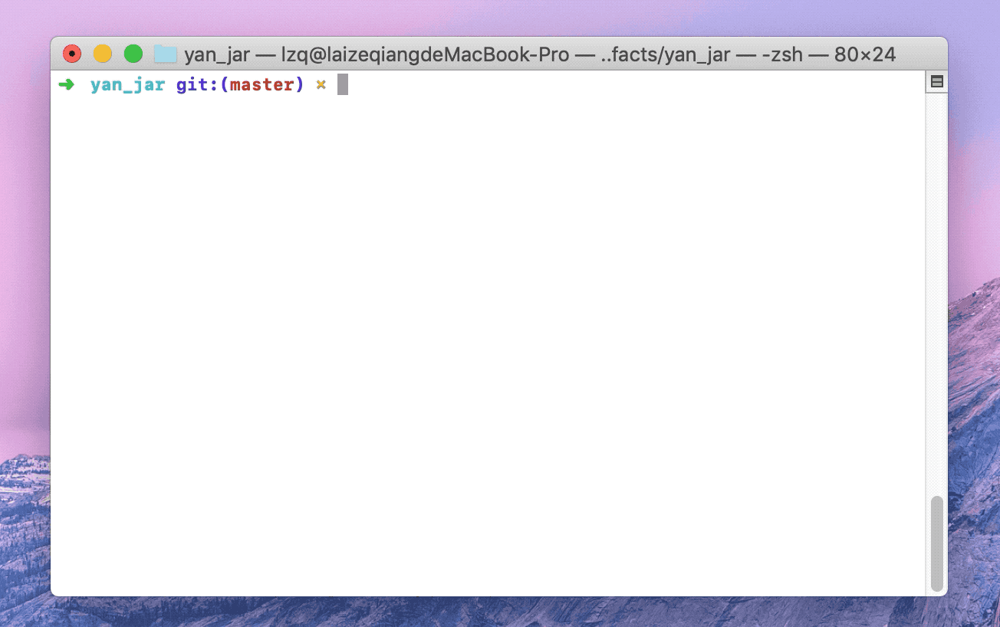

# Yan Programming Language

Yan is a programming language that has a clean and modern syntax. Different from C programming language, **Yan is designed for teaching purpose**. Its syntax can be easily parsed by a recursive descent parser.

In this repository, we designed and implemented the **compiler** and **interpreter** for Yan  programming language.

Preview:



**Note:** this repo is being no longer maintained. The implementation of Yan is moved to a new repo [Yan2](https://github.com/Zeqiang-Lai/Yan2). An autograding system is also being developed, see [Compiler-Principle-Project-Framework](https://github.com/Zeqiang-Lai/Compiler-Principle-Project-Framework).

## Getting Started

Download the precompiled jar file [Yan.jar.zip](https://github.com/Zeqiang-Lai/Yan/files/3963356/Yan.jar.zip).

Open a terminal, and type the following command (requires JRE)

```
java -jar yan.jar
```

This command will launch the Yan interpreter, and you can type in any code Yan supports.

Have a try by yourself !

## Language Guide

To print a string "Hello, world." on the screen, just type in the following statement.

```
print("hello, world");
```

- A semicolon is required at the end of each line. This will make parsing a little easier for beginners. 

### Variable

To define a variable in Yan, you can use `var` keyword.

Like C, Yan is a strongly typed language, the type of every variable should be able to be determined at compiling stage.

```
var a:int = 3; 
```

In the example above, you define an `int` varaible `a` with the `initial value = 3`. 

You can also omit type specificier `int`, the compiler will automaticly infer the proper type for you. 

```
var a = 3;  // int
var s = "Hello, world"; // string
var c = 4.5;  // float
```

If you omit the type specificier, you must provide a initial value for the variable. Otherwise, the compiler could not infer the type.

**All types supported by Yan**: int, float, string, char, bool

### Control Flow

Use `if` to make conditionals, and use `while` to make loops. Both of parentheses around the condition or loop variable and braces around the body are required.

```
if(a > b) {
	print(a);
} else {
	print(b);
}
```

In an `if` statement, the conditional must be able to be evaluated as an integer, any value except zero will be considered as `true`. 

```
a = 10;
while(a > 0) {
	print(a)
	a -= 1;
}
```

The requirement for loop variable is the same as it is for conditional of `if` statement. 

You can also you `break` and `continue` in loop body.

### Function

Use `func` to declare a function, and use `->` to sperate the parameter names and types from the function's return type. 

```
func f(x: int) -> int {
	if(x == 1 || x == 2) {
		return 1;
	}
	return f(x-1) + f(x-2);
}
```

Call a function by following its name with a list of arguments in parentheses. 

```
print(f(10));
```

### Expression

1. Assignment

```
a = 10;
```

2. Logical expression

```
a || b;
c && d;
```

3. Equality and comparsion

```
a != b;
c == d;
a >= b; c > d;
a <= b; c < d;
```

4. Arithmetic experssion

```
a + b; a - b;
a * b; a / b;
```

5. type casting

```
a = (int)b;
```


For formal language specification, please refer to [Language Specification](https://github.com/Zeqiang-Lai/Yan/blob/master/docs/language_specification.md).